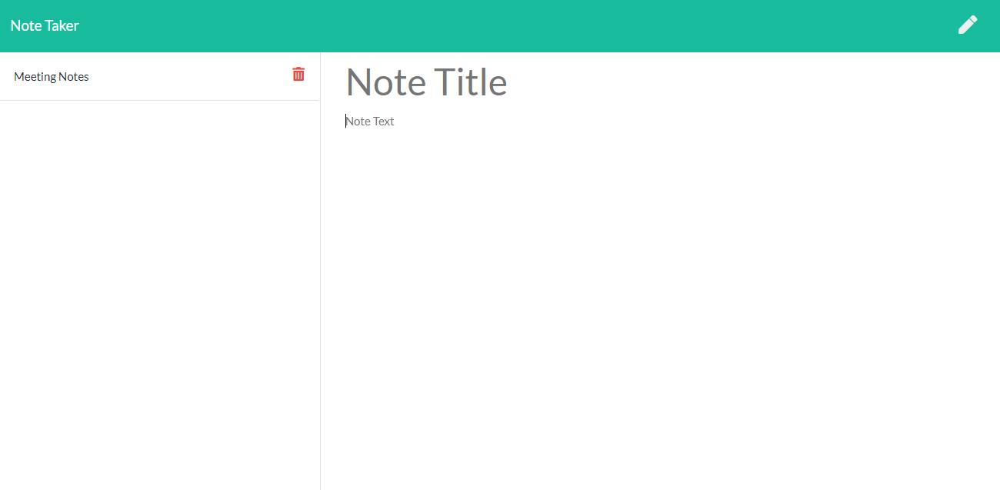

# note-taker
  
   
  
  ## Description 
  note-taker is a simple note taking application which stores plain text values for the note title and note body. The Note Taker uses ExpressJS to simplify CRUD methods.

  ## Table of Contents
  * [Installation](#installation)
  * [Usage](#usage)
  * [Questions](#questions)
  * [License](#license)
  
  ## Installation
  
<i>Steps required to install application, dependencies and configure the environment:</i>

  * Clone the repository to your local environment. 
  * Navigate to the root folder and run `npm install` using the terminal to install project dependencies. 
  * Use your browser to open localhost on PORT:3001 `http://localhost:3001` or visit Heroku-hosted site at: `https://github.com/justpuzey/note-taker`

  ## Preview
  
 
  ## Usage
  
<i>Instructions for application usage including examples:</i>

  * Add new notes by filling out the Note Title and Note Text and clicking the save icon in the top-right corner
  * View previously created notes by selecting the note in the left column
  * Delete existing notes by selecting the trash can icon in the left-hand column

  ## Questions
  If you have any questions, please contact: 
  (GitHub User):[`justpuzey`](github.com/justpuzey) 
  email: justpuzey@gmail.com

  ## License
  MIT
  
  